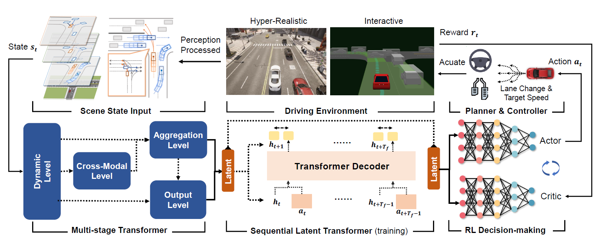

# Augmenting Reinforcement Learning with Transformer-based Scene Representation Learning for Decision-making of Autonomous Driving
[Haochen Liu](https://scholar.google.com/citations?user=iizqKUsAAAAJ&hl=en), [Zhiyu Huang](https://mczhi.github.io/), [Xiaoyu Mo](https://scholar.google.com/citations?user=JUYVmAQAAAAJ&hl=zh-CN), [Chen Lv](https://scholar.google.com/citations?user=UKVs2CEAAAAJ&hl=en) 

[AutoMan Research Lab, Nanyang Technological University](https://lvchen.wixsite.com/automan)

## Abstract 
Decision-making for urban autonomous driving is challenging due to the stochastic nature of interactive traffic participants and the complexity of road structures. Although reinforcement learning (RL)-based decision-making schemes are promising to handle urban driving scenarios, they suffer from low sample efficiency and poor adaptability. In this paper, we propose Scene-Rep Transformer to enhance the RL decision-making capabilities through improved scene representation encoding and sequential predictive latent distillation. Specifically, a multi-stage Transformer (MST) encoder is constructed to model not only the interaction awareness between the ego vehicle and its neighbors but also intention awareness between the agents and their candidate routes. A sequential latent Transformer (SLT) with self-supervised learning objectives is employed to distill future predictive information into the latent scene representation, in order to reduce the exploration space and speed up training. The final decision-making module based on soft actor-critic (SAC) takes as input the refined latent scene representation from the Scene-Rep Transformer and generates decisions. The framework is validated in five challenging simulated urban scenarios with dense traffic, and its performance is manifested quantitatively by substantial improvements in data efficiency and performance in terms of success rate, safety, and efficiency. Qualitative results reveal that our framework is able to extract the intentions of neighbor agents, enabling better decision-making and more diversified driving behaviors.

## Method Overview 

## Results

### CARLA Urban unsignalized left turn
| Scene-Rep Transformer | Drq | PPO |
|:-------------------------------------:|:---------------------------------------:|:---------------------------------------:|
||||

### SMARTS Unprotected left turn 

### SMARTS Double merging

## Acknowledgements

RL implementations are based on [tf2rl](https://github.com/keiohta/tf2rl) 

Official release for the strong baselines: [DrQ](https://github.com/denisyarats/drq); [Decision-Transformer](https://github.com/kzl/decision-transformer)
